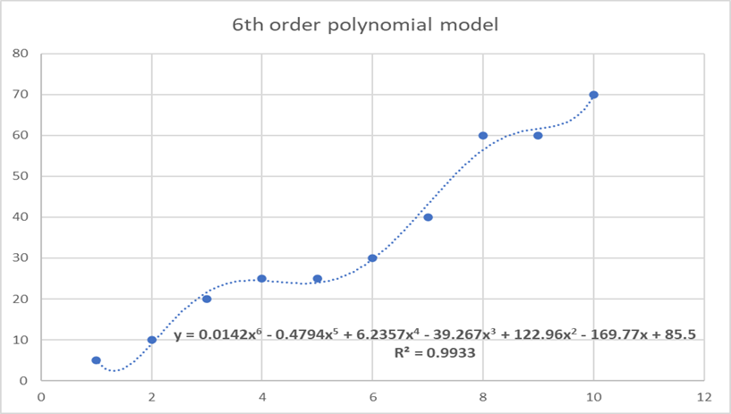
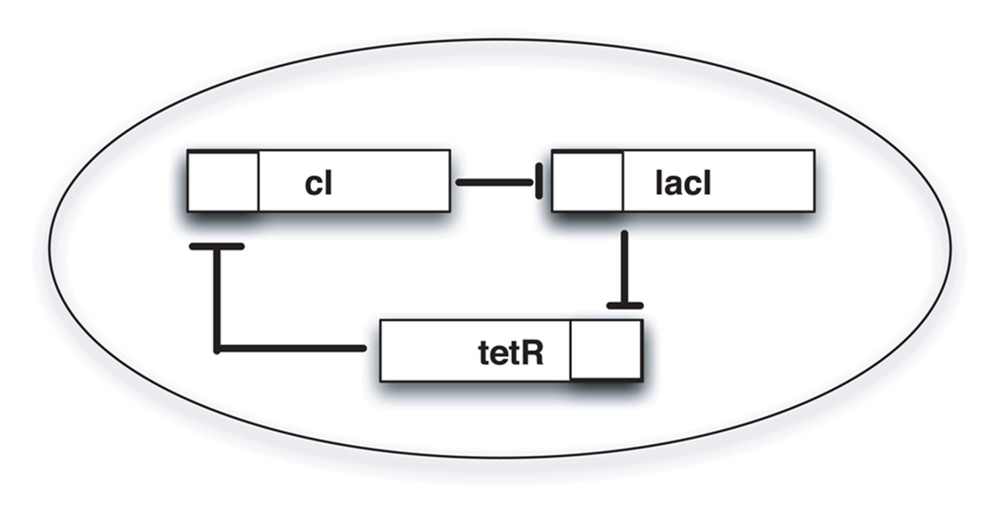
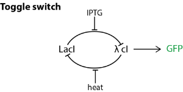
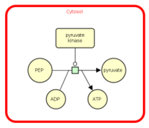

# Chapter 1: Introduction to modelling

1.  While studying the metabolic pathways of a cell, the following four reactions were considered to play an important role in cell metabolism,
<pre>
R1: &rightarrow; A
R2: A  &rightarrow; B
R3: A + B  &rightarrow; C
R4: C  &rightarrow; 
</pre>
But to do computational analyses, these reactions have to be represented mathematically. Can you represent these reactions using a matrix?  
Hint: The matrix will have each column representing each reaction and each rows metabolite. If a metabolite m1 is consumed in R1, then the value corresponding to (m1, R1) will be -1. If m2 is produced in R1, then (m2, R1) will be +1. If m3 does not involve in R1, then (m3, R1) will be 0.  
a.  
    \begin{bmatrix}
    1 & -1 & -1 & 0 \\
    0 & 1 & -1 & 0 \\
    0 & 0 & 1 & -1
    \end{bmatrix}   
b.  
    \begin{bmatrix}
    1 & -1 & 0 & 0 \\
    0 & 1 & 0 & 0 \\
    1 & 1 & 1 & -1
    \end{bmatrix}   
c.  
    \begin{bmatrix}
    -1 & -1 & -1 & 1 \\
    0 & 1 & 1 & 0 \\
    0 & 0 & -1 & 1
    \end{bmatrix}   
d. 
    \begin{bmatrix}
    0 & -1 & -1 & 0 \\
    1 & -1 & 1 & 0 \\
    1 & 0 & 1 & 0
    \end{bmatrix} 

**Ans: 
    \begin{bmatrix}
    1 & -1 & -1 & 0 \\
    0 & 1 & -1 & 0 \\
    0 & 0 & 1 & -1
    \end{bmatrix} **

2.  In an experiment, the following data was obtained.  

|Conc. of substrate|Conc. of product|
|------------------|----------------|
|       1          |        5       |
|       2          |        10      |
|       3          |        20      |
|       4          |        25      |
|       5          |        25      |
|       6          |        30      |
|       7          |        40      |
|       8          |        60      |
|       9          |        60      |
|       10         |        70      |

This data was plotted on a graph, and a 6th-degree polynomial equation gave a perfect fit with an  R^2  value of 0.9933.

Then they tried to predict the product concentration further by increasing the substrate concentration. The predicted values significantly differed from the experimental values. What might be the reason?  
a.  This happens for no reason.  
b.  The model is underfitting. Hence a better model with a higher R^2 value must be selected.  
c.  The model is overfitting. Therefore, a better model can be chosen even though the R^2 value is less than that of the current model.  
d.  None of the above.  

**Ans: c**

3.  What is the name of the following circuit?

a.  Oscillator  
b.  Repressilator  
c.  Toggle Switch  
d.  Amplifier  

**Ans: b**

4.  The simple biological circuit given below is called a toggle switch.

A toggle switch consists of two promoters (say P1 and P2) and two repressors (say R1 and R2). R2 represses P1 and R1 represses P2. There are two inducers I1 and I2, inducing P1 and P2, respectively.  
Then based on the above biological circuit, which of the following are true? More than one statement is true.  
a.  The presence of both IPTG and heat leads to partial GFP production.  
b.  The presence of only heat leads to complete GFP production.  
c.  The presence of only IPTG leads to complete GFP production.  
d.  The presence of only heat does not lead to GFP production.  
e.  The presence of only IPTG does not lead to GFP production.  

**Ans: a, c, d**

5.  The below ODE equations represent a simple SIR model of an X disease.  

 \frac{dS}{dt} = - \frac{\beta SI}{N}   
 \frac{dI}{dt} = \frac{\beta SI}{N} - \gamma I   
 \frac{dR}{dt} = \gamma I   

Where N – total population, S, I, R – people susceptible, infected, recovered, respectively.  
β – the rate of infection and γ - the rate of recovery.  
What are all the assumptions made to generate this model? More than one statement may be correct.  
a.  The total population varies with time.  
b.  The total population is fixed throughout.  
c.  There are only three categories of people in this population, susceptible, infected, and recovered.  
d.  The infected people would not infect the susceptible.  
e.  The recovered people cannot be infected.  

**Ans: b, c, e**

6.  The rate determining step of Michaelis-Menten kinetics is:  
a.  The complex dissociation step to produce products  
b.  The complex formation step  
c.  The product formation step  
d.  None of the above  

**Ans: a**

7.  What is/are the correct interpretations of the image below?

a.  The reaction takes place in the cytosol  
b.  ATP is required for the reaction to proceed  
c.  The reaction is catalysed by pyruvate kinase  
d.  All of the above  

**Ans: a, c**