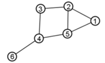

# Chapter 2: Introduction to graph theory

1.  A previous class of students had analyzed some data and constructed a small network. All they have left behind for the next batch is an adjacency matrix, given below.  


    \begin{bmatrix}
    0 & 3 & 0 & 0 & 0 & 0 & 0 \\
    0 & 0 & 1 & 0 & 0 & 0 & 0 \\
    0 & 0 & 0 & 1 & 5 & 0 & 0 \\
    0 & 0 & 0 & 0 & 0 & 0 & 10 \\
    0 & 0 & 0 & 0 & 0 & 2 & 0 \\
    0 & 0 & 0 & 3 & 0 & 0 & 0 \\
    0 & 1 & 0 & 0 & 0 & 0 & 0
    \end{bmatrix} 


What do you think the network represents?  
a.  A weighted, undirected, sparse network.  
b.  A weighted, directed, sparse network.  
c.  An unweighted, undirected, sparse network.  
d.  An unweighted, directed, sparse network.  
e.  This information cannot be obtained from the adjacency matrix.  

**Ans: b**

2.  Which of the following statements is/are TRUE for undirected graphs?  

    **A: Number of odd degree vertices is even.**  
    **B: Sum of degrees of all vertices is even.**  

a.  A only  
b.  B only  
c.  Both A and B  
d.  Neither A nor B  

**Ans: c**

3.  I was a part of a team whose job was to study a biological network we recently constructed. We felt that properties such as the clustering coefficient, the diameter of the network, the characteristic pathlength all meant something special about the network. Still, we did not know how to verify it. I have the following four options in mind. Help me get a good name amongst my mates by choosing the correct method for me.  
a.  Build the network again from scratch, and if we get the network with the same properties, they are unique.  
b.  Convince teammates; no verification required.  
c.  Generate many random networks with the same no. of nodes and edges, check if our network properties are very distinct from 95-100% of random networks generated.  
d.  Both a and c.  

**Ans: c**

4.  The degree of all nodes would be the same in which of the following networks? More than one statement may be true.  
a.  Hypergraphs.  
b.  Small-world (ring lattice) networks.  
c.  Regular ring lattices.  
d.  Complete graphs.  
e.  An Erdős–Rényi random network with n nodes and the probability of connecting edges as 1.  

**Ans: a, c, d, e**

5.  Answer the following questions from the following graph  

i)  Degree of node 5:  
**Ans: 3**  
ii) Number of connected components:  
**Ans: 1**  
iii)    Betweenness centrality of node 4:  
**Ans: 0.45**  
iv) Average clustering coefficient of the network:  
**Ans: 0.277**  
v)  Diameter of a network:  
**Ans: 3**

6.  Which of the following is/are NOT a node property?
a.  Degree  
b.  Clustering coefficient  
c.  Betweenness centrality  
d.  Characteristic path length  

**Ans: d**

7.  The local clustering coefficient of a node within a clique is:  
a.  Infinite  
b.  1  
c.  0  
d.  None of the above  

**Ans: b**

8.  A graph G(V, E) is constructed such that each node is a metabolite and the edges represent reactions by which one metabolite can be converted to another. Every metabolite can be converted into any other metabolite in the graph through a set of reactions. What type of a graph is G?  
a.  Sparse  
b.  Complete   
c.  Strongly connected  

**Ans: c**

9.  When you delete the node with the highest betweenness centrality, the characteristic path length  
a.  decreases  
b.  increases  
c.  does not change  
d.  cannot be determined  

**Ans: b**

10. Preferential attachment is a characteristic of  
a.  Random network  
b.  Small world network  
c.  Power-law network  
d.  All of the above  

**Ans: c**
