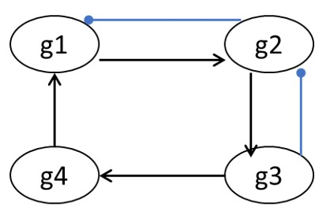

# Chapter 7: Discrete dynamic models: Boolean networks

1.  Consider the following reaction sequence and choose the correct statement(s) about the essentiality of the genes, g1, g2 and g3.
<pre>
R1: A + B &rightarrow; C        g1 OR g2
R2: C + A  &rightarrow; D       g2 OR g3
R3: B + D  &rightarrow; E + F   g1 AND g2
R4: A + D  &rightarrow; E + F   g1 AND g2
R5: E + F  &rightarrow; Biomass    
</pre>
&nbsp;&nbsp;&nbsp;&nbsp;&nbsp;&nbsp;&nbsp;&nbsp;a.  g1 is non-essential  
&nbsp;&nbsp;&nbsp;&nbsp;&nbsp;&nbsp;&nbsp;&nbsp;b.  g2 is non-essential  
&nbsp;&nbsp;&nbsp;&nbsp;&nbsp;&nbsp;&nbsp;&nbsp;c.  g3 is non-essential  
&nbsp;&nbsp;&nbsp;&nbsp;&nbsp;&nbsp;&nbsp;&nbsp;d.  g1, g2 and g3 are all essentials  
&nbsp;&nbsp;&nbsp;&nbsp;&nbsp;&nbsp;&nbsp;&nbsp;**Ans: c**

2.  The following figure shows a simple gene regulatory network. Normal arrowheads on the edges indicate activation and circle-headed blue arrows indicate inhibition/repression. Check the correct Boolean transfer function(s).

&nbsp;&nbsp;&nbsp;&nbsp;&nbsp;&nbsp;&nbsp;&nbsp;a.  g1* = g4 AND (NOT g2)  
&nbsp;&nbsp;&nbsp;&nbsp;&nbsp;&nbsp;&nbsp;&nbsp;b.  g2* = g1 AND (NOT g3)  
&nbsp;&nbsp;&nbsp;&nbsp;&nbsp;&nbsp;&nbsp;&nbsp;c.  g3* = NOT g4  
&nbsp;&nbsp;&nbsp;&nbsp;&nbsp;&nbsp;&nbsp;&nbsp;d.  g2* = g3 AND (NOT g1)  

&nbsp;&nbsp;&nbsp;&nbsp;&nbsp;&nbsp;&nbsp;&nbsp;**Ans: a, b**