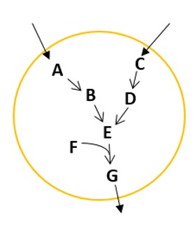

# Chapter 8: Introduction to constraint-based modelling

1.  Match the constraints given in the table below with their physical significance.  
a.  A – ii, B – i, C – iii  
b.  A – iii, B – i, C – ii  
c.  A – iii, B – ii, C – i  
d.  A – i, B – ii, C – i  

| I                 | II                                            |
|-------------------|-----------------------------------------------|
| (A) Stoichiometry | (i) Thermodynamic feasibility and equilibrium |
| (B) Reversibility | (ii) Turnover number of involved enzyme       |
| (C) Capacity      | (iii) Conservation of mass                    |

&nbsp;&nbsp;&nbsp;&nbsp;&nbsp;&nbsp;&nbsp;&nbsp;**Ans: b**

2.  Which of the following statements is/are correct?  
a.  One flux balance equation is written for each metabolite present in the system.  
b.  One flux balance equation is written for each reaction occurring in the system.  
c.  Metabolites constitute the rows and reactions constitute the columns of the stoichiometric matrix.  
d.  Generally in a biochemical system, we can find unique flux distribution for metabolic reactions.  
**Ans: a, c**

3.  Download the iAF1260 model from [BiGG database](http://bigg.ucsd.edu/) and load it in MATLAB. A structure named ‘iAF1260’ will form in the workspace. Use `linprog` to find the maximum biomass value for this model.  
**Ans: 0.7367**

4.  The function `linprog` in MATLAB does minimization of the objective function by default. Since you want to use it for maximizing the growth rate, you would pass -c^{T}v as the objective function. So, the optimum value returned by `linprog` is actually the minimum of -c^{T}v. To obtain the required values of maximum biomass growth rate and the flux distribution, I say you should (i) multiply -1 to the optimum value and (ii) multiply -1 to all the flux values.  
What do you think about my statements?  
a.  Both (i) and (ii) are true  
b.  Both (i) and (ii) are false  
c.  (i) is false, (ii) is true  
d.  (i) is true, (ii) is false  
**Ans: d**

5.  Match the following in the context of constraint based metabolic modelling :-  
_r_: number of reactions, _m_: number of metabolites   

| I           | II                      | III                                     |
|-------------|-------------------------|-----------------------------------------|
| (A.i) _m_>_r_   | (B.i) Unique solution   | (C.i) Least squares                     |
| (A.ii) _r_>_m_  | (B.ii) Under-determined | (C.ii) Many possible flux distributions |
| (A.iii) _r_=_m_ | (B.iii) Over-determined | (C.iii) Trivial solution                |

&nbsp;&nbsp;&nbsp;&nbsp;&nbsp;&nbsp;&nbsp;&nbsp;a.  A.i – B.i – C.i;        A.ii – B.ii – C.ii;     A.iii – B.iii – C.iii  
&nbsp;&nbsp;&nbsp;&nbsp;&nbsp;&nbsp;&nbsp;&nbsp;b.  A.i – B.iii – C.i;  A.ii - B.ii – C.ii;     A.iii – B.i – C.iii  
&nbsp;&nbsp;&nbsp;&nbsp;&nbsp;&nbsp;&nbsp;&nbsp;c.  A.i – B.ii – C.i;       A.ii – B.i – C.iii;     A.iii – B.iii – C.ii  
&nbsp;&nbsp;&nbsp;&nbsp;&nbsp;&nbsp;&nbsp;&nbsp;d.  A.i – B.i – C.ii;       A.ii – B.iii – C.i;     A.iii – B.ii – C.iii  
&nbsp;&nbsp;&nbsp;&nbsp;&nbsp;&nbsp;&nbsp;&nbsp;**Ans: b** 

6.  The figure below depicts the metabolic network of a fictitious organism. It can grow on two substrates (A & C). The pathways utilizing the two substrates are as shown in the figure and G is an indication of the biomass. A and C are only uptaken and not secreted, i.e., the exchange fluxes are only in the direction indicated in the figure. The cell tries to maximize the flux of G. Which of the following statements is/are true?

    

    a.  This network is blocked when only A is uptaken. However, it can grow when C is provided and hence this network is “conditionally” blocked.  
    b.  This network is unconditionally blocked and will not show growth in the presence of any substrate.  
    c.  When FBA is done on this network, except the biomass flux, every other flux will have a non-zero value.  
    d.  When FBA is done on this network, all the fluxes will be 0.  
    **Ans: b, d**

7.  If you conduct FVA for the case considered in question 6, what do you expect?  
a.  vmin = vmax = 0 for all fluxes  
b.  vmin = 0 and vmax ≠ 0 for all fluxes  
c.  vmin ≠ 0 and vmax = 0 for all fluxes  
d.  vmin ≠ 0 and vmax ≠ 0 for all fluxes  
**Ans: a**

